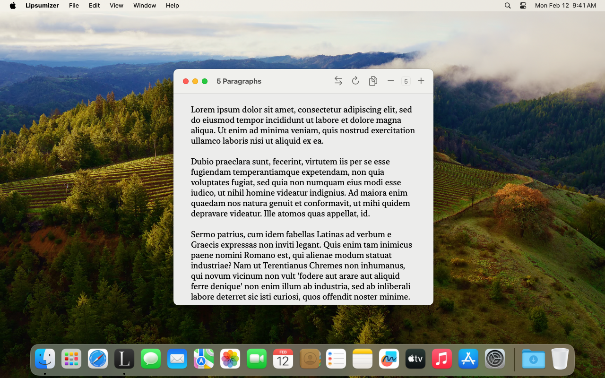

# Lipsumizer

Lipsumizer is a random placeholder text generator for prototyping.

- It generates any number of words or paragraphs of random text
- The generated text, while random, looks realistic (as long as you don't speak Latin!)
- Generate from custom text you provide, instead of the default "Lorem ipsum" text
- Choose whether to start with "Lorem ipsum" or not

### Screenshots

